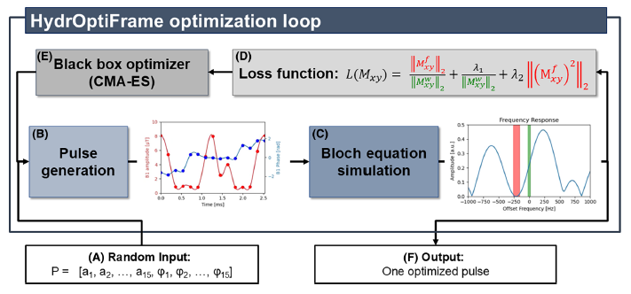
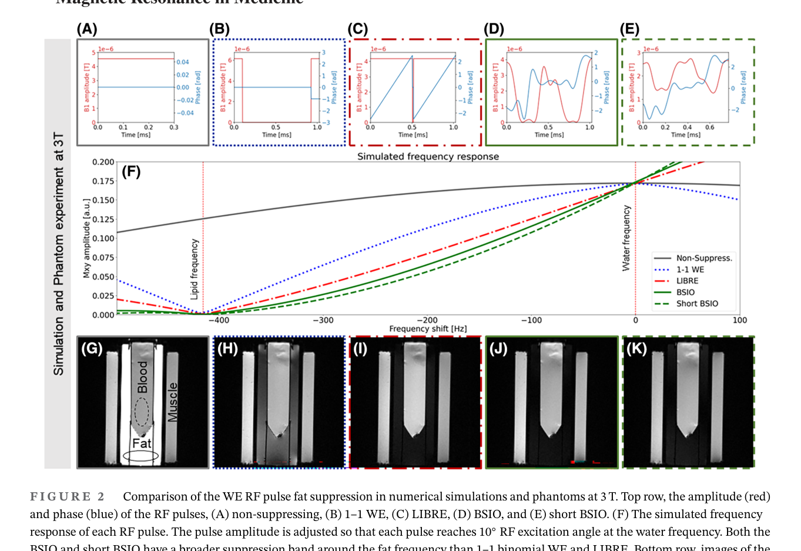
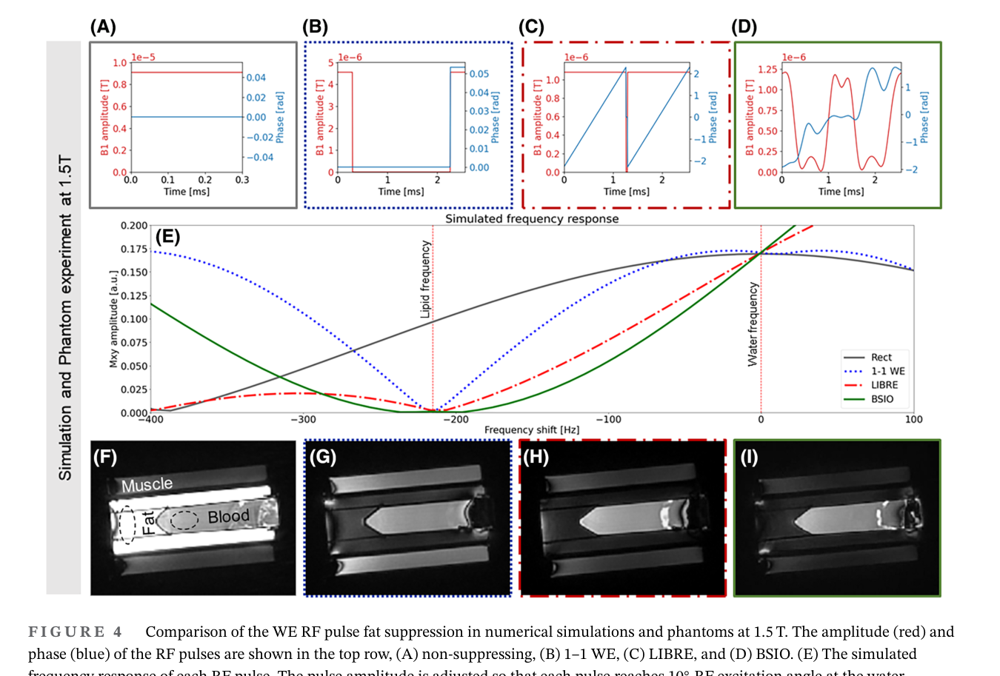
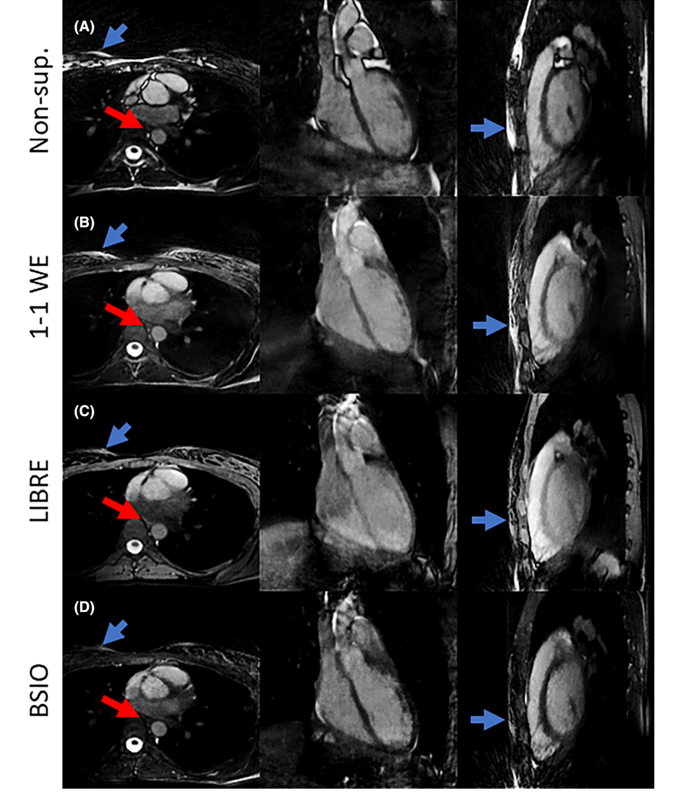

<div align="center">

# HydrOptiFrame

### Flexible optimization framework for water-excitation RF pulse design

[](https://www.python.org/)
[](https://streamlit.io/)
[](https://optuna.org/)
[
[](#citation)

HydrOptiFrame designs smooth, time-efficient water-excitation (WE) RF pulses for MRI by optimizing RF amplitude and phase waveforms with B-spline interpolation and Bloch-equation simulation.

</div>

---

## Overview

**HydrOptiFrame** is a Python framework for the numerical design and optimization of water-excitation radio-frequency (RF) pulses. It was developed to generate **B-spline interpolated optimized (BSIO)** RF pulses that excite water while suppressing lipid signal.

The framework targets application-specific pulse design where conventional analytical WE pulse designs, such as 1-1 binomial or LIBRE pulses, may be limited by a small number of tunable parameters. Instead of manually tuning a small set of offsets and phases, HydrOptiFrame optimizes a richer set of RF amplitude and phase control points, converts them into a smooth pulse waveform, simulates the spectral response, and iteratively improves the pulse using a derivative-free optimizer.

HydrOptiFrame was described in Sieber et al., *Magnetic Resonance in Medicine*, where optimized pulses were evaluated in simulation, phantom experiments, 3 T knee MRI, and 1.5 T free-running whole-heart cardiovascular MRI.

---

## Why HydrOptiFrame?

- **Flexible RF pulse design** - optimize pulse duration, field strength, flip angle, number of control points, frequency bands, and waveform constraints.
- **Smooth pulse generation** - use B-spline interpolation to generate continuous RF amplitude and phase waveforms from sparse control points.
- **Physics-based objective** - evaluate candidate pulses with Bloch-equation simulations over off-resonance frequencies.
- **Fat-water contrast optimization** - minimize lipid excitation while maintaining water excitation.
- **Robustness-oriented design** - broaden the lipid suppression band to improve tolerance to B0 inhomogeneity.
- **Multiple execution modes** - run from a Python script for reproducible experiments or from a Streamlit browser UI for interactive exploration.
- **Scanner-ready export** - export optimized waveforms to `.pta` pulse files for downstream use.

---

## Framework concept

HydrOptiFrame performs an iterative black-box optimization of an RF pulse:

1. Randomly initialize amplitude and phase control points.
2. Interpolate the control points into a smooth RF waveform using B-splines.
3. Simulate the frequency response with Bloch equations.
4. Evaluate a composite loss function that rewards water excitation and lipid suppression.
5. Use a CMA-ES optimizer through Optuna to suggest the next candidate pulse.
6. Save the best pulse, figures, report, and exported `.pta` file.

<p align="center">
  
</p>

<p align="center"><em>HydrOptiFrame optimization loop: pulse generation, Bloch simulation, loss evaluation, and CMA-ES parameter update.</em></p>

---

## Results examples from the publication

The publication demonstrates optimized BSIO pulses at both 3 T and 1.5 T. In simulation and phantom experiments, the BSIO pulses produced broader lipid suppression bands than conventional 1-1 WE and LIBRE pulses.

<p align="center">
  
</p>

<p align="center"><em>Example 3 T comparison of non-suppressing, 1-1 WE, LIBRE, BSIO, and short BSIO pulses.</em></p>

<p align="center">
  
</p>

<p align="center"><em>Example 1.5 T comparison showing the optimized BSIO pulse and its broader lipid suppression region.</em></p>

In free-running whole-heart bSSFP imaging at 1.5 T, the optimized BSIO pulse improved the suppression of chest and epicardial fat compared with the reference water-excitation pulses.

<p align="center">
  
</p>

---

## Repository structure

```text
HydrOptiFrame/
├── main.py              # Script-based entry point for optimization
├── ui.py                # Streamlit user interface
├── pulse.py             # RF pulse object and waveform generation
├── optimiser.py         # Bloch simulation, loss function, Optuna/CMA-ES optimization
├── results.py           # Plotting, report writing, and PTA export
├── requirements.txt     # Python dependencies
├── Results/             # Generated optimization outputs
├── Figures/             # Optional figures/assets
└── README.md
```

---

## Installation

### 1. Clone the repository

```bash
git clone https://github.com/Siebix1/HydrOptiFrame.git
cd HydrOptiFrame
```

### 2. Create a virtual environment

```bash
python -m venv .venv
```

Activate it:

```bash
# macOS / Linux
source .venv/bin/activate

# Windows PowerShell
.venv\Scripts\Activate.ps1
```

### 3. Install dependencies

```bash
pip install --upgrade pip
pip install -r requirements.txt
```

The project currently uses the following main packages:

```text
numpy<2
scipy
matplotlib
numba
joblib
tqdm
sigpy
optuna
cmaes
streamlit
```

---

## How to run - Streamlit UI

The Streamlit interface is the easiest way to explore the framework interactively.

```bash
streamlit run ui.py
```

This opens a browser-based interface where you can set pulse and optimization parameters, including:

- number of control points
- pulse duration
- number of temporal samples
- target flip angle
- B-spline order
- magnetic field strength
- amplitude and phase bounds
- number of optimization trials
- CMA-ES `sigma0`

After optimization, the UI displays the best objective value, output folder, generated report, figures, and downloadable `.pta` files.

Typical workflow:

1. Start with the default spline pulse settings.
2. Increase `Number of optimisation trials` for a more complete search.
3. Run optimization.
4. Inspect the generated pulse, frequency response, and B1 map.
5. Download the exported `.pta` file from the UI.

---

## How to run - Python script

For reproducible experiments or batch optimization, edit the parameters in `main.py` and run:

```bash
python main.py
```

The default script workflow is:

```python
pulse_template = RFPulse(
    amp=np.zeros(15),
    phi=np.zeros(15),
    T=2.0,
    NT=256,
    set_edges_to_zero=False,
    waveform_type="spline",
    spline_order=2,
    flip=10,
)

optimiser = PulseOptimiser(
    pulse_template=pulse_template,
    n_points=15,
    n_epochs=100,
    SYSFIELD=3.0,
)

optimiser.optimise()
best_pulse = optimiser.get_best_pulse()

results = PulseResults(
    pulse=best_pulse,
    optimiser=optimiser,
)

results.plot_all()
results.export_pta()
results.write_report()
```

For publication-style or final pulse design, increase `n_epochs` substantially. The paper used long optimization runs to identify robust pulses; the small default value is useful for quick testing.

---

## Key parameters

### Pulse parameters

| Parameter | Meaning |
|---|---|
| `amp` | Amplitude control points optimized by the algorithm |
| `phi` | Phase control points optimized by the algorithm |
| `T` | RF pulse duration in milliseconds |
| `NT` | Number of time samples used to represent the waveform |
| `flip` | Target flip angle in degrees |
| `waveform_type` | Pulse model, typically `spline` for optimized BSIO pulses |
| `spline_order` | B-spline order used to interpolate control points |
| `set_edges_to_zero` | Optionally constrain pulse edges to zero |

### Optimizer and simulation parameters

| Parameter | Meaning |
|---|---|
| `n_points` | Number of amplitude and phase control points |
| `n_epochs` | Number of Optuna optimization trials |
| `SYSFIELD` | Main magnetic field strength in Tesla |
| `FATBAND` | Lipid suppression band used in the objective |
| `WATBAND` | Water excitation band used in the objective |
| `amp_lim_low`, `amp_lim_high` | Search bounds for amplitude control points |
| `phi_lim` | Search bound for phase control points |
| `sigma0` | Initial CMA-ES search width |

---

## Outputs

Each run creates a timestamped folder in `Results/`, for example:

```text
Results/HydrOptiFrame_Pulse_3T_2p000ms_20260306_150554/
```

Typical outputs include:

| Output | Description |
|---|---|
| `report.txt` | Full run summary with pulse, optimizer, simulation, and best-parameter values |
| `*.png` | Pulse amplitude/phase plots, frequency response plots, and B1 maps |
| `*.pta` | Exported RF pulse file |

---

## Code architecture

### `pulse.py`

Defines the `RFPulse` dataclass. It stores amplitude and phase control points, pulse duration, temporal sampling, flip angle, and waveform type. For `waveform_type="spline"`, it uses B-spline interpolation to turn the sparse optimized points into a smooth RF waveform.

### `optimiser.py`

Defines `PulseOptimiser`. This file contains the Bloch simulation kernels, off-resonance response simulation, loss-function terms, and the Optuna/CMA-ES optimization loop. Candidate pulses are generated, simulated, scored, and iteratively improved.

### `results.py`

Defines `PulseResults`. It handles output-folder creation, plots the optimized pulse and simulated response, writes a complete `report.txt`, and exports the optimized pulse to `.pta` format.

### `main.py`

Minimal reproducible script for defining a pulse template, running the optimizer, and exporting the result.

### `ui.py`

Streamlit user interface for running optimizations from a browser and inspecting output files interactively.

---

## Recommended workflow

For a quick test:

```bash
python main.py
```

For interactive parameter exploration:

```bash
streamlit run ui.py
```

For serious pulse optimization:

1. Choose the target field strength, pulse duration, flip angle, and desired fat/water bands.
2. Start with 15 control points and 256 temporal samples.
3. Run a moderate number of trials to verify the setup.
4. Increase `n_epochs` for the final optimization.
5. Inspect the frequency response and fat suppression band.
6. Export the `.pta` pulse and document the run using `report.txt`.

---

## Notes and limitations

- Optimized pulses should be validated for the intended scanner, pulse sequence, flip angle, field strength, and SAR constraints before experimental or clinical use.
- The current Streamlit optimization workflow is designed primarily for spline pulses.
- Higher flip-angle applications may require careful SAR evaluation and possible retuning of the loss-function regularization.
- The framework is research software and should be used by people familiar with RF pulse design and MRI safety constraints.

---

## Citation

If you use HydrOptiFrame or build on this framework, please cite:

```bibtex
@article{SieberHydrOptiFrame2025,
  title   = {A flexible framework for the design and optimization of water-excitation RF pulses using B-spline interpolation},
  author  = {Sieber, Xavier and Romanin, Ludovica and Bastiaansen, Jessica A. M. and Roy, Christopher W. and Yerly, Jerome and Wenz, Daniel and Richiardi, Jonas and Stuber, Matthias and van Heeswijk, Ruud B.},
  journal = {Magnetic Resonance in Medicine},
  year    = {2025},
  volume  = {93},
  number  = {5},
  pages   = {1896--1910},
  doi     = {10.1002/mrm.30390}
}
```

---

## License

This project is released under the MIT License. Please cite the associated publication if you use HydrOptiFrame in academic work.

---

## Acknowledgements

HydrOptiFrame was developed for research on efficient water-excitation RF pulse optimization for MRI. The publication reports support from the Swiss National Science Foundation.

